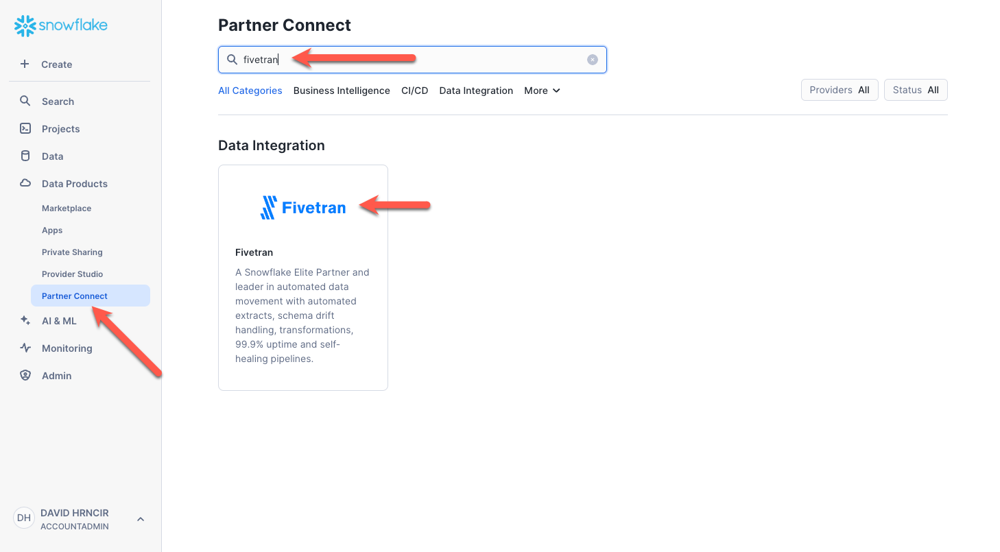
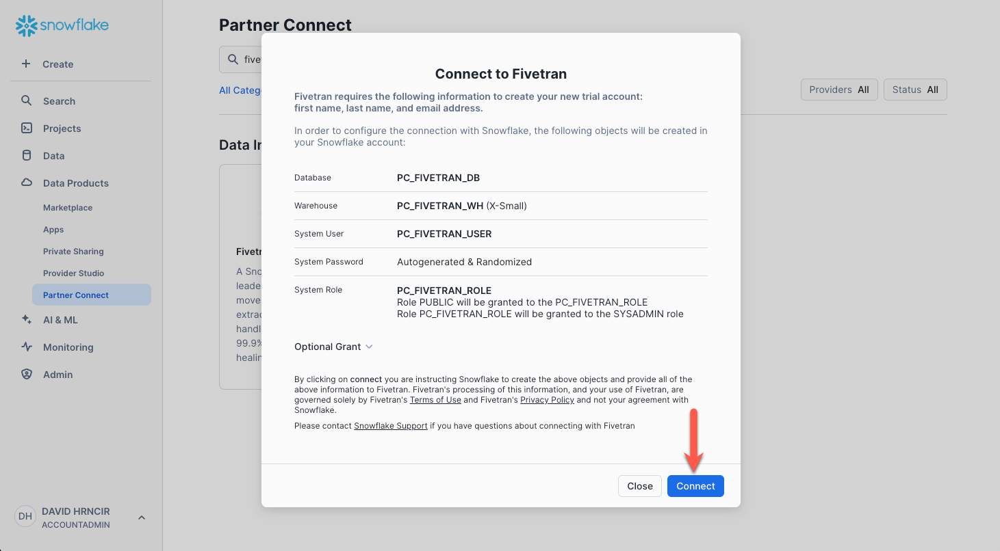
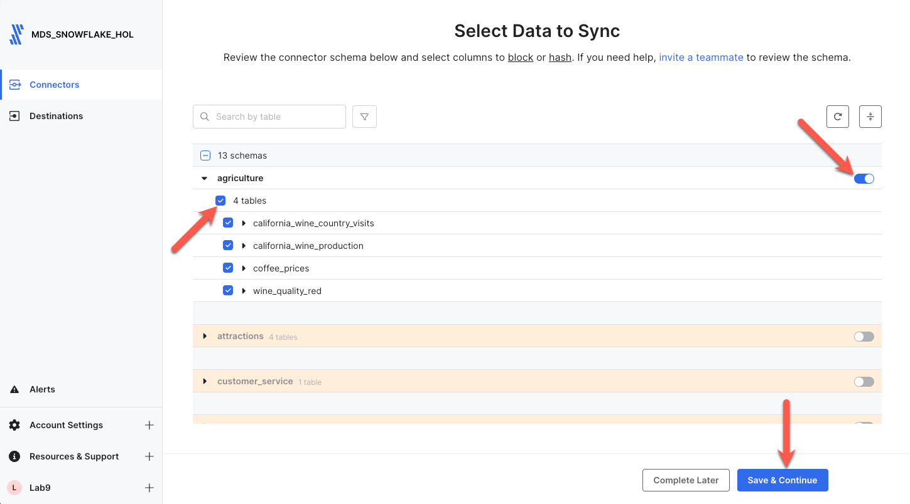
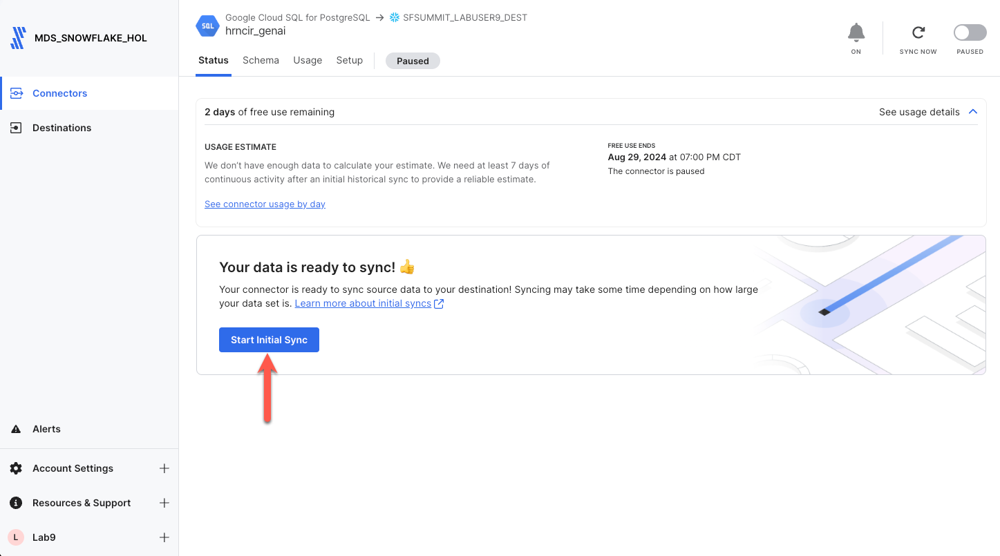
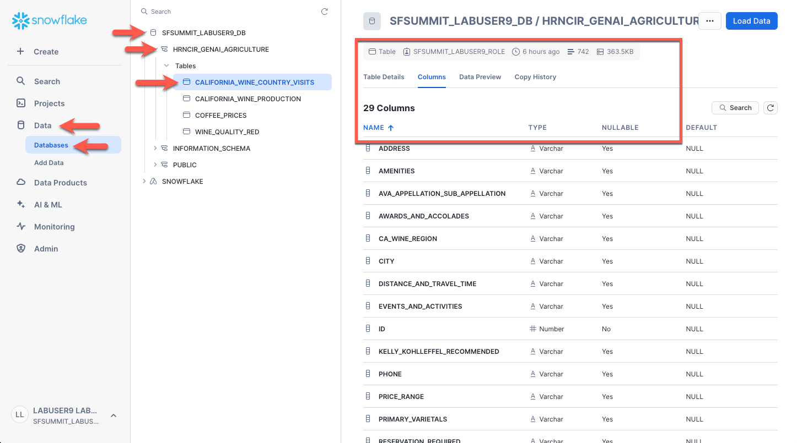
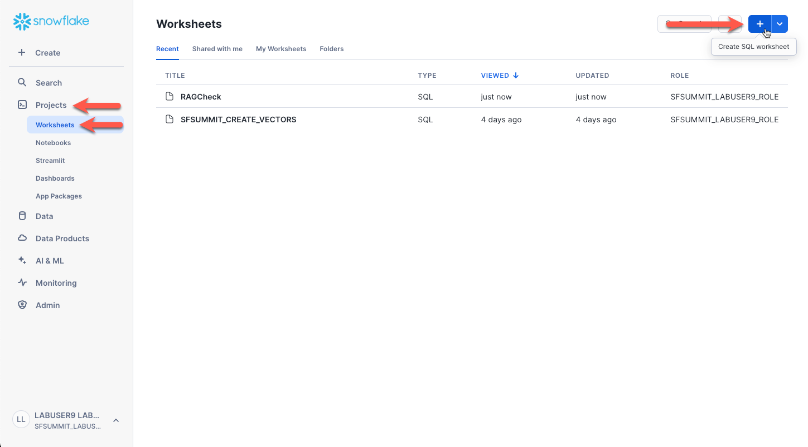
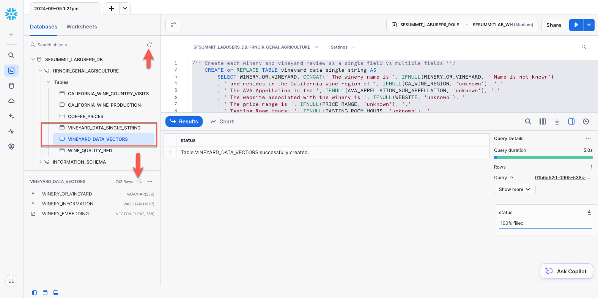
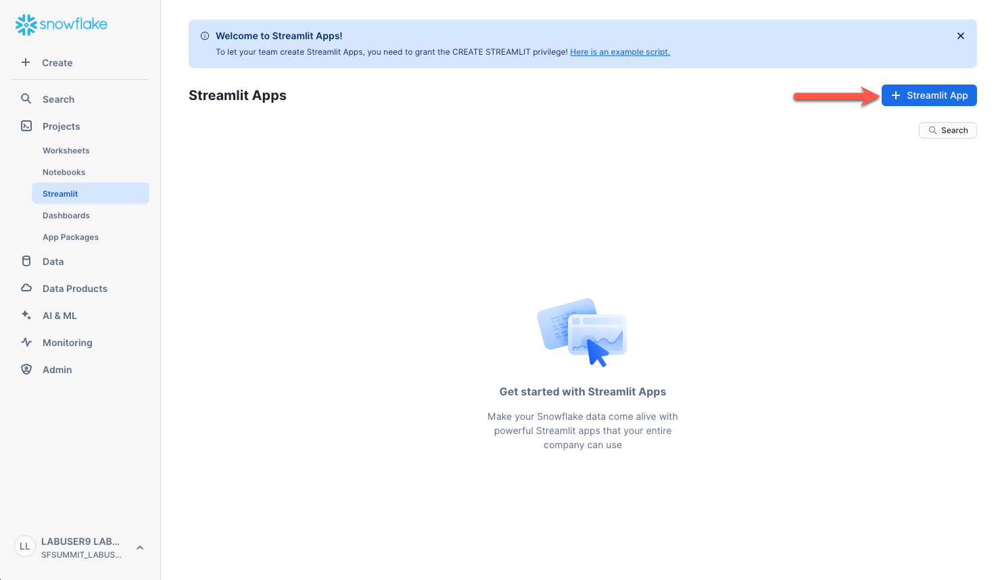
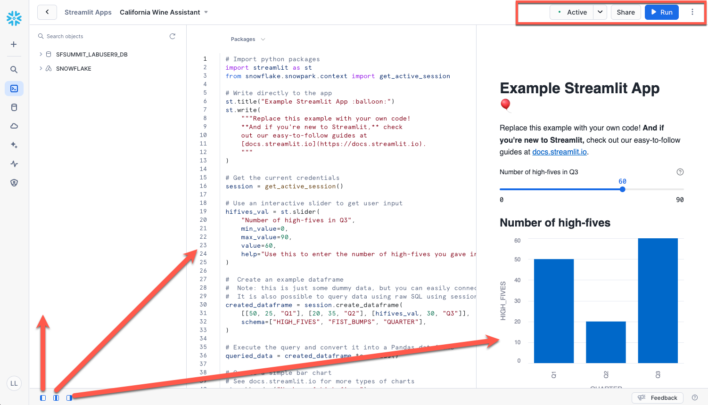

author: David Hrncir
id: fivetran_vineyard_assistant_chatbot
summary: Build a RAG Streamlit application using Fivetran and Snowflake in 30 minutes using structured data.
categories: Getting-Started, Cortex
environments: web
status: Published 
feedback link: https://github.com/Snowflake-Labs/sfguides/issues
tags: GenAI, RAG, Fivetran, chat

# Fivetran - Build a wine assistant RAG-based chatbot in 30 minutes on structured data!
<!-- ------------------------ -->
## Overview
Duration: 3

GenAI can be used to solve an unlimited number of problems, but this technology can be daunting.  Defining the problem, acquiring data related to that problem, preparing the data, assigning the appropriate models and protocols, training the data, parameter tuning, etc.  Thankfully, there are numerous LLMs available that are ready for use and can be utilized for many use cases out of the box.

But first, we need data.  Where is your most valuable data?  Typically, the valuable data is in places like SaaS applications, ERPs, and databases.  But that would be structured or semi-structured data right?  Second, we have to get that data into a data cloud.  Third, we have to build a structure that LLMs can use.  And fourth, we need to be able to build a simple application to allow us to ask questions on that data.  Sounds hard, but it's not...thanks to Fivetran and Snowflake!

And if we are going to build a GenAI app, why not make it a fun one? Today you are going to build a RAG-based GenAI application that will serve as a wine assistant to help guide you through more than 700 wineries in the California wine region.  You will be able to ask questions against this wine data to summarization, build a wine region trip, compare wineries...you name it.  And don't worry, we'll give you some examples to try.  I know what you are thinking...how can we get all of this done in 30 minutes?

Fivetran can replicate all of your data from over [600+ data sources](https://www.fivetran.com/connectors) directly into Snowflake (along with many other destinations like Iceberg data lakes) in a fast, secure, SaaS-based, automated, no-code manner where most connectors take less than 5 minutes to set up.  Imagine needing to combine many different data sources into a structure for analytics, or in this case GenAI, and all of that data fully automated and replicated into Snowflake from your data sources utilizing change data capture...the sky is the limit!

Snowflake Cortex will be used to handle all of the GenAI needs with ease making this daunting task seem simple.  We are going to be using structured data from a Postgres database.  That's right...no stagnant PDFs or HTML files...database data.  So let’s get started!

### Prerequisites
- Existing Snowflake account, or a [new Snowflake trial account](https://signup.snowflake.com/?utm_cta=quickstarts_), with 'AccountAdmin' role.  If setting up a new trial account, ensure to select the "Enterprise" edition when prompted to gain access to more Snowflake features!


### What you'll learn in the lab
- How to leverage Snowflake Partner Connect to create a Fivetran account
- How to create/configure a Fivetran Postgres database connector
- How to utilize Snowflake Cortex functions to prepare the data
- How to create the chatbot via Snowflake Streamlit

### What you'll need
- All you’ll need is a modern browser like Chrome.  Fivetran provides you the data, SQL, and Python

### What you'll build 
- A GenAI, RAG-based wine assistant chatbot in Snowflake for over 700+ real wineries in California!

All in less than 30 minutes!


## Accounts - Snowflake and Fivetran
Duration: 10

The outcome of this step is to:
- Have a Snowflake account with all the objects needed for Fivetran to ingest data (account, user, role, warehouse, database)
- Have a Fivetran account with a Snowflake destination setup ready to receive data

The easiest option to get started with Fivetran and Snowflake is to use Snowflake Partner Connect.  Partner connect allows you to quickly create a Fivetran trial account and configures the default Snowflake destination within Fivetran in one easy step.

### Partner Connect
Ensure you are in the Snowflake UI as an `ACCOUNTADMIN`.  Expand `Admin`, click `Partner Connect`, under `Data Integration` click the Fivetran tile.



Once the tile is clicked you will be presented with the Fivetran configuration screen below.  Click the `Connect` button.


 Click `Activate`.  You will be prompted to enter a Fivetran password.  Record this password.  This will be your password into the Fivetran UI.  That's it!  That will create the free 14 day Fivetran trial account, build your default Snowflake destination within Fivetran, and configure the Snowflake objects needed to ingest data via Fivetran.  


### Non-Partner Connect Only
> aside negative
> In the case where you are unable to use partner connect because of an existing linked Fivetran account, you can create a [Fivetran trial account here](https://fivetran.com/signup).  Post Fivetran account creation, you simply follow [these instructions](https://fivetran.com/docs/destinations/snowflake/setup-guide) to setup your Snowflake destination in Fivetran and Snowflake.  In the case where you have Snowflake and Fivetran accounts already, you may use a current Snowflake destination in Fivetran or simply follow the Snowflake setup guide link above to create a new Snowflake destination in Fivetran.
>

## Configure the Fivetran PostgreSQL Connector
Duration: 5

Ok, let's replicate our structured data from a PostgreSQL database into Snowflake via the quickest, easiest, and most reliable method available in the world today...Fivetran!  Ensure you are logged into your Fivetran account.

**Step 1.** With the `Connectors` item selected in the nav panel, click `Add connector`.


**Step 2.** Enter `postgres` in the search box.  Ensure you scroll down to the postgres connector shown (must use the one shown), highlight the item with your mouse, and click `Set up`.


**Step 3.** Next on the connector configuration screen, enter `yourlastname_genai` as the Destination Schema Prefix.  Next enter the credentials given below into their respective fields.  Note that the Destination Schema Prefix must be unique to the database.  Fivetran will prepend this name to all schemas copied from the postgres database into Snowflake.
- Host:  34.94.122.157
- Port:  5432
- User:  fivetran
- Password:  2PcnxqFrHh64WKbfsYDU
- Database:  industry


Scroll down and you will see the remainder of the configuration fields.  Once these two selections are made, click `Save & Test`.
- Connection Method:  Connect directly
- Update Method:  Detect Changes Via Fivetran Teleport Sync


**Step 4.** Since we are connecting directly over the internet, Fivetran requires TLS.  Click the radio button next to the certificate, and click `Confirm`.  Once all connector tests complete, click `Continue`.


**Step 5.** Next you will select the schemas and tables to replicate.  Since we only need one schema, let's first disable all schemas by unchecking the box next to the schema number shown.  Then click the `collapse all` button on the right to get a better view of all the schemas for which we have access.


Find the `Agriculture` schema in the list, click on the toggle on the right side to enable the schema, expand the schema by clicking the black arrow next to the schema, and check the box next to the number of tables to select all tables in the schema.  Then click `Save & Continue`.


**Step 6.** This screen allows you to determine how you want schema changes to be automated to from the source to the target database.  Leave `Allow all` selected, and click `Continue`.


**Step 7.** With that, we are ready to go!  Let's sync data.  Click `Start Initial Sync`, and let Fivetran seamlessly replicate our database data into Snowflake.  This should only take a minute or two at most.  This process will perform an initial sync of all of the data in the schema and tables selected, and automatically schedule itself to run again in 6 hours.  The sync frequency can be adjusted, but for this lab, there is no CDC occurring behind the scenes; so we will leave it at 6 hours.  Then on the next run and all subsequent runs, Fivetran will only replicate the changes/delta from the previous run into Snowflake ensuring your Snowflake data is always up to date with your source!


> aside positive
> This is the power of Fivetran.  No allocating resources.  No development.  No code.  No column mapping.  No pre-building tables in the destination.  A fully automated, production data pipeline in a few steps!
>
## Transform the Wine Structured Dataset
Duration: 2

So Fivetran landed the structured dataset into tables in Snowflake.  Now it's time to convert that data into data an LLM can read.  Since LLMs do not like columnar data, we have to first transform the data into a human readable chunk.  Then secondly, we are going to transform that chunk into vectors.  We could use Snowflake's vector search service, but we are doing this manually in this lab so you can understand all the aspects.  So we will be working in the Snowflake Snowsight UI for the rest of the lab.

**Security Note:  The role you are using will need to be granted the SNOWFLAKE.CORTEX_USER database role.  This role provides access to the Cortex functions we are going to use today.**

**Step 1.** Let's review our data in Snowflake.  Select `Data/Databases` and then select your database, schema, and finally the `CALIFORNIA_WINE_COUNTRY_VISITS` table.  We will transform this table to be used as RAG context for our chatbot.
From the Fivetran UI, click `Transformations` in the left navbar.  Then in the `Quickstart` section, click `Get Started`.


**Step 2.** Next we will create a new worksheet to run our transform SQL.  Select `Projects/Worksheets` and then click the plus sign in the upper right corner.


**Step 3.** In the new worksheet, expand your database and schema in the left nav panel.  Click the ellipses next to the schema Fivetran created and select `Set worksheet context`.  This will default the database and schema context for our new worksheet (shown in the box below) so that all SQL will run under your database and schema.


**Step 4.** Copy and paste the below SQL into the worksheet.

``` SQL
/** Create each winery and vineyard review as a single field vs multiple fields **/
    CREATE or REPLACE temporary TABLE single_string_winery_review AS 
    SELECT CONCAT('This winery name is ', IFNULL(WINERY_OR_VINEYARD, ' Name is not known')
        , '. California wine region: ', IFNULL(CA_WINE_REGION, 'unknown'), ''
        , ' The AVA Appellation is the ', IFNULL(AVA_APPELLATION_SUB_APPELLATION, 'unknown'), '.'
        , ' The website associated with the winery is ', IFNULL(WEBSITE, 'unknown'), '.'
        , ' Price Range: ', IFNULL(PRICE_RANGE, 'unknown'), '.'
        , ' Tasting Room Hours: ', IFNULL(TASTING_ROOM_HOURS, 'unknown'), '.'
        , ' Are Reservations Required or Not: ', IFNULL(RESERVATION_REQUIRED, 'unknown'), '.'
        , ' Winery Description: ', IFNULL(WINERY_DESCRIPTION, 'unknown'), ''
        , ' The Primary Varietals this winery offers: ', IFNULL(PRIMARY_VARIETALS, 'unknown'), '.'
        , ' Thoughts on the Tasting Room Experience: ', IFNULL(TASTING_ROOM_EXPERIENCE, 'unknown'), '.'
        , ' Amenities: ', IFNULL(AMENITIES, 'unknown'), '.'
        , ' Awards and Accolades: ', IFNULL(AWARDS_AND_ACCOLADES, 'unknown'), '.'
        , ' Distance Travel Time considerations: ', IFNULL(DISTANCE_AND_TRAVEL_TIME, 'unknown'), '.'
        , ' User Rating: ', IFNULL(USER_RATING, 'unknown'), '.'
        , ' The Secondary Varietals for this winery: ', IFNULL(SECONDARY_VARIETALS, 'unknown'), '.'
        , ' Wine Styles: ', IFNULL(WINE_STYLES, 'unknown'), '.'
        , ' Events and Activities: ', IFNULL(EVENTS_AND_ACTIVITIES, 'unknown'), '.'
        , ' Sustainability Practices: ', IFNULL(SUSTAINABILITY_PRACTICES, 'unknown'), '.'
        , ' Social Media Channels: ', IFNULL(SOCIAL_MEDIA, 'unknown'), ''
        , ' Address: ', IFNULL(ADDRESS, 'unknown'), ''
        , ' City: ', IFNULL(CITY, 'unknown'), ''
        , ' State: ', IFNULL(STATE, 'unknown'), ''
        , ' ZIP: ', IFNULL(ZIP, 'unknown'), ''
        , ' Phone: ', IFNULL(PHONE, 'unknown'), ''
        , ' Winemaker: ', IFNULL(WINEMAKER, 'unknown'), ''
        , ' Did Kelly Kohlleffel recommend this winery?: ', IFNULL(KELLY_KOHLLEFFEL_RECOMMENDED, 'unknown'), ''
    ) AS winery_information FROM california_wine_country_visits;

    /** Create the vector table from the wine review single field table **/
      CREATE or REPLACE TABLE single_string_winery_review_vector AS 
            SELECT winery_information, 
            snowflake.cortex.EMBED_TEXT_768('e5-base-v2', winery_information) as WINERY_EMBEDDING 
            FROM single_string_winery_review;
```

Highlight all of the SQL and click the run button in the upper right corner.


You may then preview the data by refreshing the left nav panel (click the `refresh` icon).  You will see that two new tables were created.  You may select the tables and click the preview icon if you wish to view the transformations.


That's it for transforming the data...now we are ready to build our Streamlit app!

## Build the Chatbot as a Streamlit Application
Duration: 2
We are now ready to build our Streamlit application.  Snowflake's Streamlit feature makes creating and sharing applications easy.

**Step 1.** Click the Projects icon in the left menu and select `Streamlit`.


**Step 2.** Click the `+Streamlit App` in the upper right corner of the screen.


Type a name for your chat app.  **VERY IMPORTANT: Ensure you choose the database and schema containing your data.**  Once the fields are set, click `Create`.


**Step 3.** Get used to the interface and remove the default code.

Let's first understand how this screen operates. 

The top right contains application controls.  To change the application settings, click the vertical three dots.  But the two main features of this are the `Run` button and the `Edit` button.  You will notice below that the `Edit` button is not shown.  That is because we are in edit mode.  The next time you go to the Streamlit section and select your application, it will be in "Run" mode, and `Edit` will appear.  This is how you edit your application later.

The second portion of the screen is the bottom left panel controls.  There are three that can be toggled on and off.  The first expands/collapses the left nav panel.  The second expands/collapses the code panel.  The third expands/collapses the running application panel.  Get to know how these three buttons work by turning them off and on.  When developing/editing, it seems to be easier having the left nav panel and the right application panel off allowing the code panel to have the full screen.


Once you are comfortable, make the code panel enabled and click in the code, highlight all the code and delete it.  This is simply the default code for a new application.

**Step 4.** Add the code below to the empty code editor.

``` python
#
# Fivetran Snowflake Cortex Lab
# Build a California Wine Assistant Chatbot
#

import streamlit as st
from snowflake.snowpark.context import get_active_session
import pandas as pd
import re
import time

# Change this list as needed to add/remove model capabilities.
MODELS = [
    "snowflake-arctic",
    "reka-flash",
    "llama3-70b",
    "llama2-70b-chat",
    "gemma-7b",
    "mistral-large",
    "mixtral-8x7b",
    "llama3-8b",
    "mistral-7b"
]

# Change this value to control the number of tokens you allow the user to change to control RAG context.
CHUNK_NUMBER = [5,6,7,8,9,10,12,16,20]

def build_layout():
    #
    # Builds the layout for the app side and main panels and return the question from the dynamic text_input control.
    #

    # Setup the state variables.
    # Resets text input ID to enable it to be cleared since currently there is no native clear.
    if 'reset_key' not in st.session_state: 
        st.session_state.reset_key = 0
    # Holds the list of responses so the user can see changes while selecting other models and settings.
    if 'conversation_state' not in st.session_state:
        st.session_state.conversation_state = []

    # Build the layout.
    #
    # Note:  Do not alter the manner in which the objects are laid out.  Streamlit requires this order because of references.
    #
    st.set_page_config(layout="wide")
    st.title(":wine_glass: California Wine Country Visit Assistant :wine_glass:")
    st.write("""I'm an interactive California Wine Country Visit Assistant. A bit about me...I'm a RAG-based, Gen AI app **built 
      with and powered by Fivetran, Snowflake, Streamlit, and Cortex** and I use a custom, structured dataset!""")
    st.caption("""Let me help plan your trip to California wine country. Using the dataset you just moved into the Snowflake Data 
      Cloud with Fivetran, I'll assist you with winery and vineyard information and provide visit recommendations from numerous 
      models available in Snowflake Cortex (including Snowflake Arctic). You can even pick the model you want to use or try out 
      all the models. The dataset includes over **700 wineries and vineyards** across all CA wine-producing regions including the 
      North Coast, Central Coast, Central Valley, South Coast and various AVAs sub-AVAs. Let's get started!""")
    user_question_placeholder = "Message your personal CA Wine Country Visit Assistant..."
    st.sidebar.selectbox("Select a Snowflake Cortex model:", MODELS, key="model_name")
    st.sidebar.checkbox('Use your Fivetran dataset as context?', key="dataset_context")
    if st.button('Reset conversation', key='reset_conversation_button'):
        st.session_state.conversation_state = []
        st.session_state.reset_key += 1
        st.experimental_rerun()
    processing_placeholder = st.empty()
    question = st.text_input("", placeholder=user_question_placeholder, key=f"text_input_{st.session_state.reset_key}", 
                             label_visibility="collapsed")
    if st.session_state.dataset_context:
        st.caption("""Please note that :green[**_I am_**] using your Fivetran dataset as context. All models are very 
          creative and can make mistakes. Consider checking important information before heading out to wine country.""")
    else:
        st.caption("""Please note that :red[**_I am NOT_**] using your Fivetran dataset as context. All models are very 
          creative and can make mistakes. Consider checking important information before heading out to wine country.""")
    with st.sidebar.expander("Advanced options"):
        st.selectbox("Select number of context chunks:", CHUNK_NUMBER, key="num_retrieved_chunks")
        st.checkbox(
            'Show Token Count', value=True, key="show_token_count")
    st.sidebar.caption("""I use **Snowflake Cortex** which provides instant access to industry-leading large language models (LLMs), 
      including **Snowflake Arctic**, trained by researchers at companies like Mistral, Meta, Google, Reka, and Snowflake.\n\nCortex 
      also offers models that Snowflake has fine-tuned for specific use cases. Since these LLMs are fully hosted and managed by 
      Snowflake, using them requires no setup. My data stays within Snowflake, giving me the performance, scalability, and governance 
      you expect.""")
    for _ in range(12):
        st.sidebar.write("")
    url = 'https://i.imgur.com/9lS8Y34.png'
    col1, col2, col3 = st.sidebar.columns([1,2,1.3])
    with col2:
        st.image(url, width=150)
    caption_col1, caption_col2, caption_col3 = st.sidebar.columns([0.22,2,0.005])
    with caption_col2:
        st.caption("Fivetran, Snowflake, Streamlit & Cortex")

    return question

def build_prompt (question):
    #
    # Format the prompt based on if the user chooses to use the RAG option or not.
    #

    # Build the RAG prompt if the user chooses.
    if st.session_state.dataset_context:
        context_cmd = f"""
          with context_cte as
          (select winery_information as winery_chunk, vector_cosine_similarity(winery_embedding,
                snowflake.cortex.embed_text_768('e5-base-v2', ?)) as v_sim
          from single_string_winery_review_vector
          order by v_sim desc
          limit ?)
          select winery_chunk from context_cte 
          """
        chunk_limit = st.session_state.num_retrieved_chunks
        context_df = session.sql(context_cmd, params=[question, chunk_limit]).to_pandas()
        context_len = len(context_df) -1

        rag_context = ""
        for i in range (0, context_len):
            rag_context += context_df._get_value(i, 'WINERY_CHUNK')
        rag_context = rag_context.replace("'", "''")

        new_prompt = f"""
          'Act as a California winery visit expert for visitors to California wine country who want an incredible visit and 
          tasting experience. You are a personal visit assistant named Snowflake CA Wine Country Visit Assistant. Provide 
          the most accurate information on California wineries based on winery_information from 
          vineyard_data_vectors table. Only provide information if there is an exact match in the given Context.
          Context: {rag_context}
          Question: {question} 
          Answer: '
          """
    else:
        # Build the generic version of the prompt without RAG.
        new_prompt = f"""
          'Act as a California winery visit expert for visitors to California wine country who want an incredible visit and 
          tasting experience. You are a personal visit assistant named Snowflake CA Wine Country Visit Assistant. Provide 
          the most accurate information on California wineries.
          Question: {question} 
          Answer: '
          """
    
    return new_prompt

def get_model_token_count(question):
    #
    # Calculate and return the token count for the model and question used.
    #
    try:
        token_count_sql = f"""
          select SNOWFLAKE.CORTEX.COUNT_TOKENS('{st.session_state.model_name}', '{question}') as token_count;
          """
        token_count_data = session.sql(token_count_sql).collect()
        token_count = token_count_data[0][0]
        
        return token_count
    except Exception as e:
        token_count = -1

def calc_times(start_time, first_token_time, end_time, token_count):
    #
    # Calculate the times for the execution steps.
    #

    # Calculate the correct durations
    time_to_first_token = first_token_time - start_time  # Time to the first token
    total_duration = end_time - start_time  # Total time to generate all tokens
    time_for_remaining_tokens = total_duration - time_to_first_token  # Time for the remaining tokens
    
    # Calculate tokens per second rate
    tokens_per_second = token_count / total_duration if total_duration > 0 else 1
    
    # Ensure that time to first token is realistically non-zero
    if time_to_first_token < 0.01:  # Adjust the threshold as needed
        time_to_first_token = total_duration / 2  # A rough estimate if it's too small

    return time_to_first_token, time_for_remaining_tokens, tokens_per_second

def run_prompt(question):
    #
    # Run the prompt against Cortex.
    #
    formatted_prompt = build_prompt (question)
    cmd = f"""
             select SNOWFLAKE.CORTEX.COMPLETE(?,?) as response
           """
    token_count = get_model_token_count(question)
    start_time = time.time()
    sql_resp = session.sql(cmd, params=[st.session_state.model_name, formatted_prompt])
    first_token_time = time.time() 
    answer_df = sql_resp.collect()
    end_time = time.time()
    time_to_first_token, time_for_remaining_tokens, tokens_per_second = calc_times(start_time, first_token_time, end_time, token_count)
    
    return answer_df, time_to_first_token, time_for_remaining_tokens, tokens_per_second, token_count

def main():
    #
    # Controls the flow of the app.
    #
    question = build_layout()
    if question:
        with st.spinner("Thinking..."):
            try:
                # Run the prompt.
                data, time_to_first_token, time_for_remaining_tokens, tokens_per_second, token_count = run_prompt(question)
                response = data[0][0]
                # Conditionally append the token count line based on the checkbox
                if st.session_state.show_token_count:
                    st.session_state.conversation_state.append(
                        (f"🔢 Token Count for '{st.session_state.model_name}':", 
                         f"""<span style='color:#808080;'>{token_count} tokens • {tokens_per_second:.2f} tokens/s • 
                         {time_to_first_token:.2f}s to first token + {time_for_remaining_tokens:.2f}s</span>""")
                    )
                # Append the new results.
                st.session_state.conversation_state.append((f"CA Wine Country Visit Assistant ({st.session_state.model_name}):", response))
                st.session_state.conversation_state.append(("You:", question))
            except Exception as e:
                st.warning(f"An error occurred while processing your question: {e}")
        
        # Display the results in a stacked format.
        if st.session_state.conversation_state:
            for i in reversed(range(len(st.session_state.conversation_state))):
                label, message = st.session_state.conversation_state[i]
                if 'Token Count' in label:
                    # Display the token count in a specific format
                    st.markdown(f"**{label}** {message}", unsafe_allow_html=True)
                elif i % 2 == 0:
                    st.write(f":wine_glass:**{label}** {message}")
                else:
                    st.write(f":question:**{label}** {message}")

if __name__ == "__main__":
    #
    # App startup method.
    #
    session = get_active_session()
    
    main()

```

**Step 5.** Let's break down the code before we run the application.

The application is Python utilizing packages and services hosted in Snowflake.  So the very top of the code imports all packages and references needed to execute the application.  The `MODELS` and `CHUNK_NUMBER` lists load the drop down lists in the left nave panel of the application and are at the top for easy access in the case you would like to alter the list.  The models listed are the ones that are available in Snowflake at the time of the creation of this quickstart.  This list will probably be updated very soon with new and/or updated models.  So change these as needed based on the [LLMs available](https://docs.snowflake.com/en/user-guide/snowflake-cortex/llm-functions#availability).  The chunks list values are part of the RAG (retrieval-augmented generation) process.  This number represents how many items/chunks do I want to automatically insert into my context that I send to the LLM so the LLM answers questions about my data.  You will notice that some prompts may only need 5 chunks when you only ask about a few items in your data.  Other, more complex prompts, will require increased chunks.  You will know this when you start to see hallucinations or data that you know is in your dataset comes back with "unknown".  See the [token limitations](https://docs.snowflake.com/en/user-guide/snowflake-cortex/llm-functions#model-restrictions) to better understand how much data can be sent to these LLMs.

Now we can breakdown the functions relatively easy.  The first (starting from the top) is `build_layout`.  This function is builds out the content in the main panel where you type your prompt and the left nav panel where you adjust your application settings such as choosing a different model.  The order is like HTML where the objects are rendered how they are defined top-to-bottom.

The next function `build_prompt` builds much of the "persona" for you as well as builds the RAG or non-RAG prompt depending if you check the box to use your data.  I suggest you try both to see the differences.  The rest of the prompt structure such as content, task, format, and possibly example are added by you...where truly, those are not completely needed to get results.  But a better prompt structure means better results...depending on the model.  We give some pretty fun examples in the next section.

The `get_model_token_count` function calculates what Snowflake will use to run the prompt against the LLM.  See the [Cost Considerations](https://docs.snowflake.com/en/user-guide/snowflake-cortex/llm-functions#cost-considerations) in the docs.

The `calc_times` function performs some additional insight into how fast various Cortex calls take to help benchmark LLM efficiency.

The `run_prompt` is the controller function that formats the prompt, calls Cortex, and builds the run times for the processes.

Last, the `main` function, like any other Python application, is the entry point to the entire process, calls all other processes, and displays the results in reverse order so that your most recent prompt results are at the top.

## Run the Chatbot
Duration: 5
Finally, we get to play with our new wine assistant!  


### Recap
> aside positive
> You can see that with Fivetran Quickstart Data Models, there is no code, no git, and no deployments!  This 'T' in 'ELT' is a great value-add and a great way to start you on your transformations journey.  The open source for these transformations can be found in the [dbt Package Hub](https://hub.getdbt.com/).  One item to note here.  [dbt Labs](https://www.getdbt.com/) creates push-down SQL which runs inside Snowflake.  Fivetran's implementation of this logic incurs no costs on the Fivetran side; transformation jobs are free.  But each time a transformation is executed and data is manipulated, there will be a Snowflake warehouse running consuming Snowflake credits.
>

## Build Insights Via Snowflake Dashboard
Duration: 1

Now that our models are built and ready to query, let's build some insights into your data!  For the purposes of this lab, we will build a four tile dashboard within Snowflake.  The SQL and accompanying screenshot of each tile setup is given below.  NOTE: Only change the SQL if your database and/or schema name do not match below.

### Snowflake Dashboard
Click the `Dashboards` item in the left navbar.  This will display the Dashboard UI.  Click `+ Dashboard` in the upper right to begin the dashboard creation process.


Next give your dashboard a name and click `Create Dashboard`.


Then it's time to start building tiles.  See the image below.  Ensure to set the role to `sysadmin` and the warehouse to `pc_fivetran_wh`.  Click the `+ New Tile` to get started with the first dashboard tile.


### Tiles in Snowflake
Tiles represent dashboard objects, and each tile represents a separate execution of SQL and visualization in the dashboard.  Below is the process that can be followed for all tiles in this lab:
1. After the `New Tile` or `New Tile from Worksheet` buttons are selected, a tile worksheet will be displayed like the ones below.
2. Copy and paste the SQL for each tile into the SQL section in the tile worksheet.
3. Click the `Run` button and ensure you are receiving results.  Always use a full path in SQL for database.schema.table/view.
4. Set tile name and enable the chart display by clicking the `Chart` button (except where a table is to be rendered like Tile #4).
5. To get the tiles to look like the ones in this lab, simply apply the metadata in the `Chart Type` section (except for Tile #4) on the right side of the UI to match the image in each tile section below.

Once all the tiles are created, you may move them around on the dashboard to your liking.

### Tile 1: Stage Counts by Month - Heatgrid
```
select stage_name, close_date, amount 
from pc_fivetran_db.salesforce.salesforce__opportunity_enhanced
```


### Tile 2: Opportunities Won by Amount - Bar
```
select sum(amount) as account_amount, account_name, count(*) as num_won 
from pc_fivetran_db.salesforce.salesforce__opportunity_enhanced 
where is_won = true group by account_name order by 1
```


### Tile 3: Average Days to Close - Score
```
select round(avg(days_to_close),1) 
from pc_fivetran_db.salesforce.salesforce__opportunity_enhanced
```


### Tile 4: Top 5 Performers - Table
```
select top 5 owner_name as "Owner", avg_bookings_amount as "Avg Booking Amt", round(avg_days_to_close,1) as "Avg Days to Close", 
total_pipeline_amount as "Total Pipeline" 
from pc_fivetran_db.salesforce.salesforce__owner_performance 
where total_pipeline_amount is not null 
order by total_pipeline_amount desc
```


### Final Dashboard
Here is the example dashboard giving insights to the data for your use cases in minutes!


## Conclusion
Duration: 2

The lab demonstrates the power, flexibility, reliability, and speed to insights by performing ELT with no code!

Here's what we did:
- Created a production-ready data pipeline from Salesforce to Snowflake via Fivetran in a few clicks!
- Utilized Fivetran's Quickstart Data Models to curate the data within Snowflake for easy consumption!
- Designed and built a Snowflake dashboard to give us valuable insights into our Salesforce data!
- All in less than 40 minutes!
- But don't stop here.  Take this lab to the next level by adding more tiles and building more insights on your own!

### Snowflake
See what other customers are [doing with Snowflake](https://www.snowflake.com/en/why-snowflake/customers/) and how Snowflake is the cloud data platform for your [data workloads](https://snowflake.com)!

### Fivetran
See why [Fivetran](https://fivetran.com) is the ultimate automated data movement platform for any [data source](https://www.fivetran.com/connectors) and why Fivetran is a [Snowflake Elite Partner](https://www.snowflake.com/partners/technology-partners/) and Snowflake Data Integration Partner of the year!

Fivetran's mission is to "Make data as accessible and reliable as electricity!"  [Let us show you how we do it!](https://go.fivetran.com/demo)
